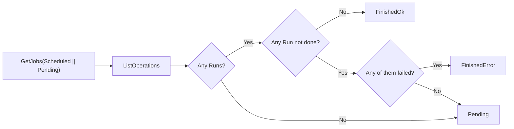
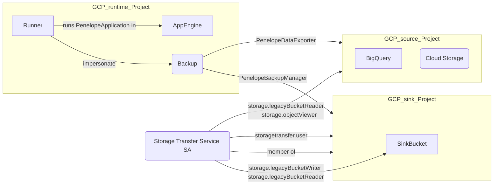

# Penelope - GCP Backup Solution


- [Penelope - GCP Backup Solution](#penelope---gcp-backup-solution)
- [Introduction](#introduction)
- [Requirements](#requirements)
- [Getting Started](#getting-started)
    - [Migration](#migration)
    - [Configuration](#configuration)
- [Deploy Basic Setup](#deploy-basic-setup)
    - [1. Step: Migration with Flyway](#1-step-migration-with-flyway)
    - [2. Step: Configuration of App Engine](#2-step-configuration-of-app-engine)
    - [3. Step: Penelope Deployment](#3-step-penelope-deployment)
    - [4. Step: Configuration of Cron-Jobs](#4-step-configuration-of-cron-jobs)
    - [5. Step: Cron-Jobs Scheduling](#5-step-cron-jobs-scheduling)
- [Providers](#providers)
    - [The Secret Provider](#the-secret-provider)
        - [Default](#default)
    - [Backup Provider](#backup-provider)
        - [Default](#default-1)
    - [Target Principal Provider](#target-principal-provider)
        - [Default](#default-2)
    - [Principal Provider](#principal-provider)
        - [Default](#default-3)
    - [Source Project Provider](#source-project-provider)
        - [Default](#default-4)
- [Internal Data Model and Backup Mechanics](#internal-data-model-and-backup-mechanics)
- [Role and rights concept](#role-and-rights-concept)

# Introduction

Penelope is a tool, which allows you to back up data stored in GCP automatically. You can create backups from BigQuery
datasets and tables as well as from Cloud Storage buckets within Google Cloud Storage. For authentication against
GCP services Penelope uses Google service accounts for performing backups and it assumes that it is behind an
authentication provider like [Google Identity Aware Proxy](https://cloud.google.com/iap).

Penelope consists of three main components:

* A Docker image for a server written in GO providing an API with different methods to create, start, etc. backups
* A web frontend allowing users to easily create and manage backup jobs
* A PostgreSQL database storing different pieces of information about backup jobs

**Bellow:** Screenshot from Penelope using the form to create a new backup


# Requirements

* Go >= 1.23
* PostgreSQL >= 15
* Google Service Account

Because Penelope uses the Google Cloud SDK, you first have to set up your local environment to access GCP. You need
to create a Google service account to authenticate Penelope.
See [Creating and managing service accounts](https://cloud.google.com/iam/docs/creating-managing-service-accounts)
documentation for more details.

# Getting Started

This repository provides a starter kit to set up Penelope on your own. Penelope uses providers for different purposes,
for example penelope needs a credential to connect with the configured database (see environment variables). You can
use Penelopes basic secret provider, which uses a specific environment variable to provide a secret credential, or
you can define a more advance provider, which for example fetches the credentials during runtime. Penelope needs four
specific providers:

* `SecretProvider` - containing the method *GetSecret*, which provides the database password for given user.
* `SinkGCPProjectProvider` - containing the method *GetSinkGCPProjectID*, which provides for a given GCP project id a
  specific cloud storage backup sink.
* `TargetPrincipalForProjectProvider` - contains the method *GetTargetPrincipalForProject*, which provides a target
  service account to be impersonated for a given project.
* `PrincipalProvider` - contains the method *GetPrincipalForEmail*, which provides the users principal (containing the
  user and role bindings) for a given email address.

## Migration

Penelope uses a PostgreSQL database to store the backup state. You can find the migrations under the
folder `resources/migrations/`.
You can use [Flyway](https://flywaydb.org/) to run the migrations against your own PostgreSQL database.

## Configuration

Penelope uses environment variables for customization. Therefore, you can configure penelope to a certain degree
by setting specific environment variables (e.g. configure database connection). There are optional and required
settings. If you not provide required settings, penelope will not run.

| Name                                                  | Required | Description                                                                                                                         |
|-------------------------------------------------------|----------|-------------------------------------------------------------------------------------------------------------------------------------|
| `GCP_PROJECT_ID`                                      | required | Set the GCP project.                                                                                                                |
| `DEFAULT_PROVIDER_BUCKET`                             | required | Set the bucket for all providers                                                                                                    |
| `DEFAULT_BACKUP_SINK_PROVIDER_FOR_PROJECT_FILE_PATH`  | required | Set the path to the `.yaml` file which contains the target backup project for `SinkGCPProjectProvider`.                             |
| `DEFAULT_USER_PRINCIPAL_PROVIDER_FILE_PATH`           | required | Set the path to the `.yaml` file which contains the user principal for `PrincipalProvider`.                                         |
| `DEFAULT_GCP_SOURCE_PROJECT_PROVIDER_FILE_PATH`       | required | Set the path to the `.yaml` file which contains the user principal for `PrincSourceGCPProjectProvideripalProvider`.                 |
| `DEFAULT_PROVIDER_CACHE_TTL`                          | required | Set  time to life (TTL) for data stored in cache by defualt providers                                                               |
| `DEFAULT_PROVIDER_IMPERSONATE_GOOGLE_SERVICE_ACCOUNT` | required | Set default impersonated google service account for `TargetPrincipalForProjectProvider`.                                            |
| `DEV_MODE`                                            | required | Set Penelope to run locally in dev mode any skipping user authentification.                                                         |
| `APP_JWT_AUDIENCE`                                    | required | Set the expected audience value of the jwt token.                                                                                   |
| `COMPANY_DOMAINS`                                     | required | Set the company domains for validating user email. Value can be a comma separated list.                                             |
| `DEFAULT_BUCKET_STORAGE_CLASS`                        | required | Set the default storage class for backup sinks.                                                                                     |
| `POSTGRES_SOCKET`                                     | required | Set socket address to PostgreSQL server.                                                                                            |
| `POSTGRES_HOST`                                       | required | Set host address to PostgreSQL server. If PostgreSQL socket is specified, setting this is optional.                                 |
| `POSTGRES_PORT`                                       | required | Set port of PostgreSQL server default to `5432`.                                                                                    |
| `POSTGRES_DB`                                         | required | Set name of PostgreSQL database.                                                                                                    |
| `POSTGRES_USER`                                       | required | Set username to connect with PostgreSQL database.                                                                                   |
| `POSTGRES_PASSWORD`                                   | required | Set password for user to connect with PostgreSQL database.                                                                          |
| `TOKEN_HEADER_KEY`                                    | required | Set the key for token header.                                                                                                       |
| `PENELOPE_PORT`                                       | optional | Set port for localhost when running Penelope local.                                                                                 |
| `PENELOPE_TRACING`                                    | optional | Set `true` to export tracing metrics to Stackdriver. Default is `true`.                                                             |
| `PENELOPE_TRACING_METRICS_PREFIX`                     | optional | Set prefix for tracing metrics when activated. Default is `penelope-server`.                                                        |
| `PENELOPE_USE_DEFAULT_HTTP_CLIENT`                    | optional | Switch to use default http request for testing by setting `true`. Default is `false`.                                               |
| `CORS_ALLOWED_METHODS`                                | optional | Set the allowed methods for CORS with a comma separated list. For example, `POST, PATCH, GET`                                       |
| `CORS_ALLOWED_ORIGIN`                                 | optional | Set the allowed origins for defined cors methods.                                                                                   |
| `CORS_ALLOWED_HEADERS`                                | optional | Set the allowed request headers.                                                                                                    |
| `TASKS_VALIDATION_HTTP_HEADER_NAME`                   | optional | Adds request validation to tasks triggers. Specifies the expected request head for validation.                                      |
| `TASKS_VALIDATION_HTTP_HEADER_VALUE`                  | optional | Expected value for request validation.                                                                                              |
| `TASKS_VALIDATION_ALLOWED_IP_ADDRESSES`               | optional | Adds ip address validation to tasks triggers. Multiple comma separated ip addresses can be specified.                               |
| `UNIFORM_BUCKET_LEVEL_ACCESS`                         | optional | Set uniform bucket level access for created backups (see [more](https://cloud.google.com/storage/docs/uniform-bucket-level-access)) |

# Deploy Basic Setup

This step-by-step guide will walk you through how to set up Penelope in your own Google App Engine instance. Let us
start with the database migration.

## 1. Step: Migration with Flyway

In the following you will learn, how you can use Flyway for migration. However, feel free to use any other tool which
fits best for your use case. The migration files are in the folder `resource/migrations` as already mentioned above.

```shell script
flyway migrate -url=jdbc:postgresql://<HOST>:<PORT>/<DB> -user=<USER> -password=<PW> -locations=filesystem:./resources/migrations
```

Because we are going to deploy Penelope to App Engine, it maybe useful to take
CloudSQL into consideration. You can use Cloud SQL Proxy to connect with your instance via a
secure connection. In order to find out more about the proxy client see the
[About the Cloud SQL Proxy](https://cloud.google.com/sql/docs/mysql/sql-proxy) documentation.

## 2. Step: Configuration of App Engine

You are going to need a `app.yaml` file to deploy and configure your App Engine service.
In this file you specify the go runtime version, url handlers and all environment variables to configure Penelope.
This repository provides a default configuration template for your own App Engine. Replace the brackets and feel
free to change the values, but be carefully with the handlers.

```yaml
# app.yaml
runtime: go125
service: default
handlers:
  - url: /
    static_files: static/ui/index.html
    upload: static/ui/index.html
  # ...

env_variables:
  GCP_PROJECT_ID: <GCP_PROJECT_ID>
  PENELOPE_PORT: <PENELOPE_PORT>
  POSTGRES_SOCKET: /cloudsql/<GCP_PROJECT>:<REGION>:<DB_INSTANCE>/.s.PGSQL.5432
  POSTGRES_USER: <POSTGRES_USER>
  POSTGRES_DB: <POSTGRES_DB>
  POSTGRES_PASSWORD: <POSTGRES_PASSWORD>
  # ...
```

## 3. Step: Penelope Deployment

Now that you have specified the configuration for Penelope, you are able to deploy the local application and
configuration settings with Cloud SDK. For more details on how to install or manage your GCP resources and
applications see [Google Cloud SDK Documentation](https://cloud.google.com/sdk/docs/quickstart). Since we are going to
deploy the application to app engine, we will use `gcloud app deploy` for deployment.

```shell script
gcloud app deploy app.yaml
```

## 4. Step: Configuration of Cron-Jobs

Congratulations. If you configured your application correctly, you successfully deployed Penelope to
App Engine. But you're not done yet. There are still tasks, which need to be triggered. These Penelope tasks are
responsible for
making backups, cleanups of expired sinks and so on. This repository provides a basic cron job configuration as well for
all
tasks. There are no changes required.

```yaml
# cron.yaml
cron:
  - description: "prepare backup jobs"
    url: /api/tasks/prepare_backup_jobs
    schedule: every 60 minutes from 00:00 to 23:00
  - description: "schedule new jobs"
    url: /api/tasks/run_new_jobs
    schedule: every 10 minutes from 00:05 to 23:55
  # ...
``` 

## 5. Step: Cron-Jobs Scheduling

Deploying the `cron.yaml` configuration file to App Engine is straight forward. You just need to run the following
command and you are finished.

```shell script
gcloud app deploy cron.yaml
```

# Providers

This section is specifically tell you about the special Penelope providers. As mentioned before, there are four
providers which provide Penelope with information like where to store the backup, which role bindings has the user and
so on.
This repository contains default providers. However, you are able to implement your own providers. In the following,
you will find out how each default provider works and how you can implement your own provider. To use your own Penelope
defined providers use `AppStartArguments` and pass it to the run function of the `github.com/ottogroup/penelope/cmd`
package.

```go
package main

import (
	"github.com/ottogroup/penelope/cmd"
)

func main() {
	// Create all your providers here ...

	appStartArguments := app.AppStartArguments{
		PrincipalProvider:                 principalProvider,
		SinkGCPProjectProvider:            sinkGCPProjectProvider,
		TargetPrincipalForProjectProvider: targetPrincipalForProjectProvider,
		SecretProvider:                    secretProvider,
	}

	cmd.Run(appStartArguments)
}
```

## The Secret Provider

Let's have a look at the first provider. The secret provider, specified by the `SecretProvider` interface, provides
Penelope with the database
password. This provider defines only one method. It receives a `context.Context` and `string` argument and returns
a `string` and `error` type. You can probably guess the meaning of each argument. However, we will go through
each parameter to be clear. The first expected argument is a context, which is created for each (http) request. This is
golang specific. If you want to find out more about the Context type, you can read
the [Package Context](https://golang.org/pkg/context/)
documentation. The next argument contains the database user name. All you have to do is to return the
password for this user. If you are not able to return the database password, you can return an error value.

```go
package secret

import "context"

type SecretProvider interface {
	GetSecret(ctxIn context.Context, user string) (string, error)
}
```

### Default

The default provider is actually pretty straight forward. It basically doesn't care about the user argument. It just
returns the
value you have specified in the `POSTGRES_PASSWORD` environment variable. If this default provider is not advance enough
for your
need, then feel free to implement your own secret provider.

## Backup Provider

The tasks of the backup sink provider is to provide Penelope with a GCP project where the backup should be stored.
This provider is defined by the `SinkGCPProjectProvider` interface. The first argument is the same for all provider
methods,
which is again context. The next argument is the source GCP project id. It is the project of the source data, which
should
be backup on a target project. The task of this interface is to return the target project for the received source
project.

```go
package provider

import "context"

type SinkGCPProjectProvider interface {
	GetSinkGCPProjectID(ctxIn context.Context, sourceGCPProjectID string) (string, error)
}
```

### Default

The default provide is a bit more complex this time. You will not only have to define the environment variables
`DEFAULT_PROVIDER_BUCKET` and `DEFAULT_BACKUP_SINK_PROVIDER_FOR_PROJECT_FILE_PATH`, you also have to store a `.yaml`
file
in the specified bucket. The content of the file should look like this.

```yaml
- project: project-one
  backup: project-one-backup
- project: project-two
  backup: project-two-backup
```

For each project you define a backup project (actually not that complex, huh?). But what happens, if a source
project is not listed in the file? Then the default implementation returns an error. You think there are other
solutions?
Maybe you would like to create a backup projects on-the-fly or just use the source project as the target project. Then
feel free to implement your own `SinkGCPProjectProvider`.

## Target Principal Provider

This provider can be more difficult to comprehend than the previous providers. Behind the scenes, Penelope uses
impersonation to create all the backup sinks and so on in GCP. And what does it impersonate to do all these tasks?
[Service accounts](https://cloud.google.com/iam/docs/understanding-service-accounts), which are special google account
to represent non-human user like applications. To determine which service account should be impersonated by Penelope,
the `TargetPrincipalForProjectProvider` interface is required. It returns the service account for a target project.

```go
package impersonate

import "context"

type TargetPrincipalForProjectProvider interface {
	GetTargetPrincipalForProject(ctxIn context.Context, projectID string) (string, error)
}
```

### Default

The default is again pretty straight forward. You only have to define one single google service account, which should
be impersonated. This is done by setting the `DEFAULT_PROVIDER_IMPERSONATE_GOOGLE_SERVICE_ACCOUNT` environment variable.

## Principal Provider

This section explains the concept of a user principal and the role of the `PrincipalProvider` interface.

### User Principal:

* A `Principal` data type represents a user's identity and access rights within the system.
* It contains two components:
    * `email`: A string representing the user's email address (unique identifier).
    * `role_bindings`: A list of role bindings, which define a user's role within each project.

### Role Binding:

* A role binding associates a project ID with a user's role for that specific project.
* Possible roles are:
    * `None`: User has no access to the project.
    * `Viewer`: User can view project data but cannot modify it.
    * `Owner`: User has full access to the project, including editing and backup privileges.

### PrincipalProvider Interface:

* The `PrincipalProvider interface defines a single method:
    * `GetPrincipal(email: string) -> Principal`: This method takes a user's email address and returns their
      corresponding Principal data type.

### Importance of PrincipalProvider:

* The `PrincipalProvider` plays a crucial role in access control.
* By retrieving a user's principal data, the system can determine their roles for specific projects.
* This information is critical for authorizing actions:
    * Only `Owner` users can perform backups.
    * Users without the appropriate role (e.g., `None` or `Viewer`) cannot edit project data.

### In summary:

* The Principal data type stores user identity and project access levels.
* The PrincipalProvider interface provides access to this information for authorization purposes.

```go
package provider

import (
	"context"
	"github.com/ottogroup/penelope/pkg/http/auth/model"
)

type PrincipalProvider interface {
	GetPrincipalForEmail(ctxIn context.Context, email string) (*model.Principal, error)
}
```

The data type `Principal` is shown in following source code, which contains additionally all relevant information.
You can see it consist of a `User` and a list of `ProjectRoleBinding`s. Furthermore, you can see that `User` only
consists of the email address. The `ProjectRoleBinding` contains the role for each project.

```go
package model

type Role string

type Principal struct {
	User         User
	RoleBindings []ProjectRoleBinding
}

type User struct {
	Email string
}

var (
	None   Role = "none"
	Viewer Role = "viewer"
	Owner  Role = "owner"
)

type ProjectRoleBinding struct {
	Role    Role
	Project string
}
```

### Default

Now let's have a look at the default implementation. The default is very similar to the `SinkGCPProjectProvider`. It
also needs the path to a `.yaml` file. Therefore `DEFAULT_USER_PRINCIPAL_PROVIDER_FILE_PATH` needs to be set.
The content can look like this.

```yaml
- user:
  email: 'first-user@example.de'
  role_bindings:
    - role: owner
      project: 'project-one'
    - role: viewer
      project: 'project-two'
- user:
  email: 'second-user@example.de'
  role_bindings:
    - role: viewer
      project: 'project-one'
    - role: viewer
      project: 'project-two'
```

## Source Project Provider

source project orincipal is used to retrieve additioanl information about the source project.
The `SourceGCPProjectProvider`
represents the interface for this provider. It contains only one method, which returns the `SourceGCPProject` for a
given
project id.

```go
package provider

import (
	"context"
)

type SourceGCPProjectProvider interface {
	GetSourceGCPProject(ctxIn context.Context, gcpProjectID string) (SourceGCPProject, error)
}
```

### Default

Now let's have a look at the default implementation. The default is very similar to the `SinkGCPProjectProvider`. It
also needs the path to a `.yaml` file. Therefore `DEFAULT_BACKUP_SINK_PROVIDER_FOR_PROJECT_FILE_PATH` needs to be set.
The content can look like this.

```yaml
- project: local-account
  availability_class: A1
  data_owner: john.doe
```

# Internal Data Model and Backup Mechanics

Penelope tracks backup configuration specified by the user as well as the backups current success state in the `backups`
table. Each backup definition lets Penelope schedule, execute and track (aka orchestrate) jobs in GCP. Depending on the
backup source a job is either implemented as

- a StorageTransferJob, if the backup source is CloudStorage
- a BigQueryExtractJob, if the backup source is BigQuery

Penelope keeps track of jobs in the `jobs` table. A fk relation to the corresponding backup indentifies which backup
definition lead to a certain job.

Both db entities - `backups` and `jobs` - have a `status` field representing the current state they are in. The `status`
field different [Penelope tasks](pkg/tasks/tasks_multiplexer.go) operate on it and trigger a state chang in the model.
State changes of `backups` are well-defined in the [processor.go](pkg/processor/processor.go).

Since a StorageTransferJob is handled by GCP, it runs asynchronously. Penelope checks job statuses in regular intervals
when the task `CheckJobsStatus` is invoked. It monitors StorageTransferJobs and corresponding TransferOperations. The
following diagram shows how the job status is assessed.



# Role and rights concept



## Service accounts

### Runner

There should be one custom service account ```runner``` that is used to run the Penelope application. This service
account should have the following roles in the project it runs:

* CloudSQL Client (`roles/cloudsql.client`)
    * to be able to connect to the database running in the same project as Penelope application
* Cloud Trace Agent
    * to be able to connect to write traces to Google Monitoring

### Backup

The GCP Projects that are created for the pure purpose to store only backup data will be accessed by the ```backup```
service accounts.

#### permission for runner service account

The ```runner``` service account should to be able to impersonate the```backup``` service account with the role: Service
Account Token Creator (`roles/roles/iam.serviceAccountTokenCreator`)

#### permission in data source (PenelopeDataExporter)

The ```backup``` service account should have the following roles in the source project:

* to be able to evaluate data store costs during backup creation
    * Monitoring Viewer (`roles/monitoring.viewer`)
* to be able to access project metadata
    * `resourcemanager.projects.get`
    * `resourcemanager.projects.list`
* to be able to list and get GCS bucket metadata
    * `storage.buckets.get`
    * `storage.buckets.list`
* to be able to make GCS Mirroring
    * Private Logs Viewer  (`roles/logging.privateLogViewer`)
* to be able to for GCS Mirroring strategy to check logging.list quota usage
    * `serviceusage.services.list`
* to be able to list and get BigQuery datasets/table/views metadata
    * `bigquery.datasets.get`
    * `bigquery.tables.get`
    * `bigquery.tables.list`
* to be able to list and export from BigQuery
    * `bigquery.tables.createSnapshot`
    * `bigquery.tables.export`
    * `bigquery.tables.getData`
    * `bigquery.tables.replicateData`

#### permission in data sink (PenelopeBackupManager)

The ```backup``` service account should have the following roles in the target (backup only) project:

* to be able to manage GCS buckets and its objects
    * `storage.buckets.create`
    * `storage.buckets.delete`
    * `storage.buckets.enableObjectRetention`
    * `storage.buckets.get`
    * `storage.buckets.getIamPolicy`
    * `storage.buckets.list`
    * `storage.buckets.setIamPolicy`
    * `storage.buckets.update`
    * `storage.objects.create`
    * `storage.objects.delete`
    * `storage.objects.get`
    * `storage.objects.list`
    * `storage.objects.update`
* to be able to trigger export jobs in BigQuery from source project(s)
    * BigQuery Job User (`roles/bigquery.jobUser`)
* to be able to create&update Storage Transfer jobs
    * Storage Transfer User (`roles/storagetransfer.user`)
* to be able to clean up backups that transit to status `BackupDeleted`
    * `storagetransfer.jobs.delete`
    * `storagetransfer.jobs.get`
    * `storagetransfer.jobs.list`
    * `bigquery.jobs.delete`
    * `bigquery.jobs.get`
    * `bigquery.jobs.list`
* to be able to check compliance permissions
    * `iam.denypolicies.list`
    * `iam.denypolicies.get`

### Storage Transfer Service Account

For the backup that are made for the bucket in the source project the service account - created by the Storage Transfer
Service, is used. The service agent's email uses the format
```project-SINK_PROJECT_NUMBER@storage-transfer-service.iam.gserviceaccount.com```.

#### permission in data source

Google's managed service account need following permission in the source project:
 
* to be able to export GCS date from source
  * on project level permissions that are part of following GCP roles
      * Storage Object Viewer (```roles/storage.objectViewer```)
      * Storage Legacy Bucket Reader (```roles/storage.legacyBucketReader```)
      * **NOTE**: this role can be set only on the bucket level you need to define custom role

#### permission in data sink

Google's managed service account need following permission in the target (backup only) project:

* on project level a role wit the following IAM permissions:
    * Storage Transfer User (`roles/storagetransfer.user`)

* on sink bucket level:
    * Storage Legacy Bucket Reader (```roles/storage.legacyBucketReader```)
        * **NOTE**: it is done automatically set by the ```runner``` service account
    * Storage Legacy Bucket Writer (```roles/storage.legacyBucketWriter```)
        * **NOTE**: it is done automatically set by the ```runner``` service account